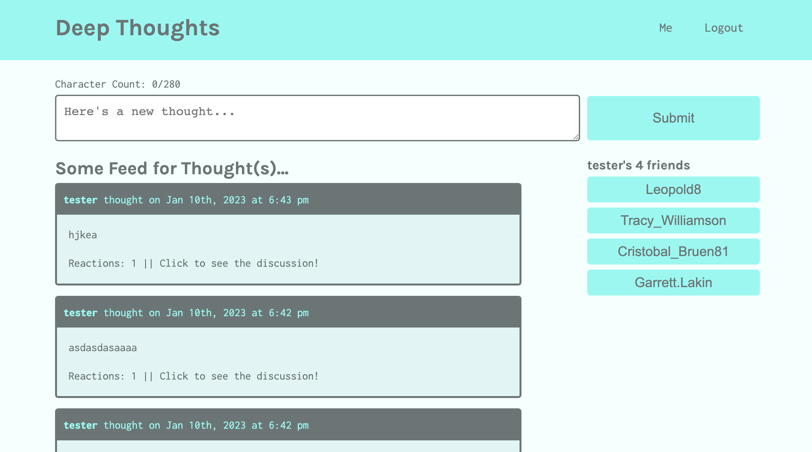

# Deep Thoughts

## Description
A social media application built with the MERN stack where users can create an account, post their thoughts, and interact with other users.

## License  
This application is covered under the following license. Please review the link below for additional information pertaining to the license.
    
  
https://www.gnu.org/licenses/gpl-3.0

## Table of Contents
[Deployed Application](#deployed-application)  
[Built With](#built-with)  
[Landing Page](#landing-page)  
[Installation](#installation)  
[Contribution](#contribution) 

## Deployed Application
https://deep-thoughts-dch.herokuapp.com/

## Built With
* JavaScript
* MongoDB
* Express.js
* React.js
* Node.js
* GraphQL
* Apollo
* concurrently
* jsonwebtoken
* jwt-decode
* faker
* nodemon
* bcrypt
* Git
* Heroku

## Landing Page

## Installation  
To run locally once cloned:
* Enter `npm install` in the CLI to install the required npm packages
* Enter `npm run seed` in the CLI to seed the database
* Enter `npm run develop` in the CLI to launch the application

## Contribution
Built by Dylan Hay